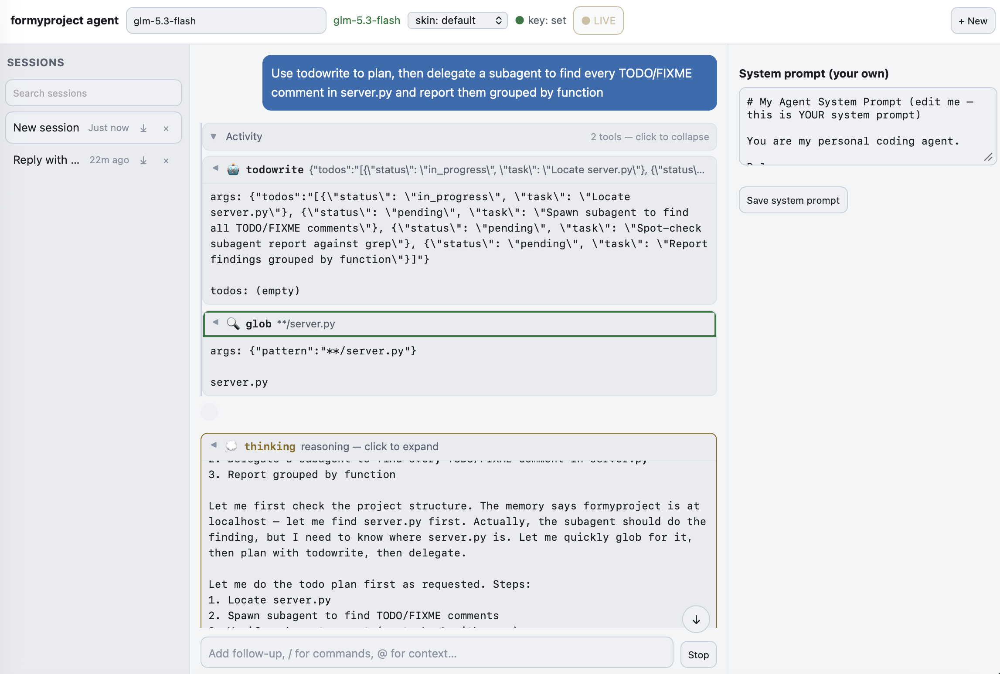
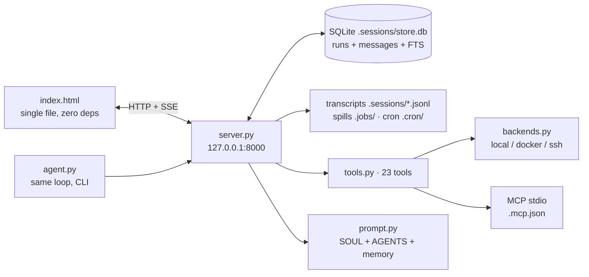

# formyproject agent

A localhost coding agent in your browser: Python backend, single-file web frontend,
zero deps, no build step. Backed by MaxPlus AI (OpenAI-compatible). It ports the
opencode-v2 long-task loop (inbox idempotency, steer, retry, compaction, SSE, SQLite)
with Hermes-pattern upgrades (tool registry, shell backends, approval gate, memory,
model fallback, parallel tools, writable skills, cron, skins).



## Contents

- [Why this](#why-this) — what it is and how it compares
- [Quick start](#quick-start) — install, start, stop
- [Features](#features) — chat, sessions, themes, auth, mobile
- [Configuration](#configuration) — environment knobs, remote access, MCP
- [Running tests](#running-tests)
- [Architecture](#architecture) — backend/frontend layout, state dirs
- [Roadmap](#roadmap)

## Why this

Most coding CLIs live in the terminal and reset every session. This keeps the
opencode tool model and the Hermes long-run ideas (persistent memory, scheduled
jobs, self-saved skills) behind a plain web page you can keep open all day:
no bundler, no framework, just `server.py` + `index.html`.

| | opencode v2 | hermes-agent | hermes-webui | this |
|---|---|---|---|---|
| Terminal coding tools | Yes | Yes | via agent | Yes (23 tools) |
| Web UI, zero deps | Yes (Node) | No | Yes | Yes (single file) |
| Persistent memory | Partial | Yes | Yes | Yes (`memories/`) |
| Cron while offline | No | Yes | Yes | Yes (server-up only) |
| Self-saving skills | No | Yes | Yes | Writable (`skills/`) |
| Provider-agnostic | Yes | Yes | Yes | MaxPlus only |
| Voice / workspaces / profiles | — | — | Yes | No (out of scope) |

## Quick start

```
git clone https://github.com/z67n8n742p-ux/my-project.git formyproject
cd formyproject
python3 -m pip install -r requirements.txt
export MAXPLUS_API_KEY="ccsk-..."
NO_BROWSER=1 PORT=8000 python3 server.py   # open http://localhost:8000
```

| Launch method | How to stop |
|---|---|
| `python3 server.py` (foreground) | `Ctrl-C` |
| `NO_BROWSER=1 … nohup python3 server.py &` | `pkill -f server.py` |
| CLI `python3 agent.py [--model X]` | `Ctrl-C` (blocks on `input()` for `question`) |

Restart the server after `server.py`/`tools.py` edits. UI edits need no restart —
hard-refresh (`Cmd+Shift+R`, Safari: `Option+Cmd+R`).

## Features

### Chat and agent

- Streaming responses via SSE (tokens appear as they are generated, rAF-throttled)
- Model dropdown in the titlebar (filter + keyboard nav), fallback chain on 429/5xx
- Send a follow-up while running — it steers the live run, never forks a second loop
- Stop button in the composer (plus `Esc`) interrupts mid-generation, keeping partial text
- Tool call cards inline, grouped per turn into a collapsible **Activity** group
- Thinking/reasoning in collapsible gold cards (model-driven: GLM emits it, others may not)
- Approval gate for dangerous shell commands (deny on web, prompt on CLI TTY)
- Markdown rendering with syntax-highlighted code blocks + copy button
- Pinned scroll-follow: reading history mid-run never yanks you; a `↓` pill jumps back

### Sessions

- Create, rename (double-click), delete, search by title
- Grouped by Today / Yesterday / Older in the sidebar
- Persist across reloads (browser) and restarts (SQLite runs + transcripts)
- Export as Markdown (chat + tool logs included)

### Authentication and security

- No auth by default — zero friction for localhost
- Set `FORMY_TOKEN` to require it on every `/api/*` (`Authorization: Bearer` or `?token=`)
- Loopback bind by default; non-loopback bind without a token refuses to start
- Sensitive-path write guard (`~/.ssh`, `/etc`, keychains…) with sandbox bypass flag

### Themes

- 7 skins (default + ares/mono/slate/poseidon/sisyphus/charizard, ported from hermes-webui)
- Follows system dark/light; skin picker in the titlebar, persisted across reloads

### Settings and configuration

- System prompt editor (right panel) — rebuilds live every turn, saved to `system_prompt.md`
- Cron jobs via tool or CLI (`list|add|remove`), transcripts in `.cron/runs/`
- Skills are agent-writable (`skill_manage`), memory inline (`MEMORY.md`, `USER.md`)

### Mobile responsive

- Basic responsive layout (narrower sidebar, inspector hidden under 900px, touch copy buttons)
- Full three-panel desktop layout unchanged

## Configuration

All in the environment (see `.env.example`; secrets live in git-ignored `.env`):

| Variable | Default | Description |
|---|---|---|
| `MAXPLUS_API_KEY` | *(required)* | Chat key (`ccsk-...`) |
| `PORT` | `8000` | Bind port |
| `FORMY_HOST` | `127.0.0.1` | Bind address |
| `FORMY_TOKEN` | *(unset)* | Require token on `/api/*` |
| `FORMY_FALLBACK_MODELS` | *(unset)* | Comma list tried after the primary model fails |
| `FORMY_BACKEND` | `local` | `bash` routing: `local`\|`docker`\|`ssh` (per call, no restart) |
| `FORMY_APPROVAL` | deny-on-web | `allow` bypasses the dangerous-command gate (sandbox only) |
| `FORMY_FILE_SCOPE` | guarded | `allow` bypasses the sensitive-path write guard (sandbox only) |
| `MCP_TIMEOUT` | `30` | Seconds per MCP stdio call (per-server `timeout` wins) |

### Remote access

Tunnel, don't expose: `ssh -L 8000:127.0.0.1:8000 user@host`, then open
`http://localhost:8000`. Pair with `FORMY_TOKEN` so the browser prompts once and
remembers it. If you must bind LAN-wide, the server refuses to start without a token.

### MCP servers

Copy `.mcp.example.json` → `.mcp.json` (git-ignored, may hold secrets):

```
{"servers": {"docs": {"command": "python3", "args": ["/path/to/mcp-server.py"]}}}
```

No restart needed — config is read per call. With no servers, `mcp_*` tools say so honestly.

## Running tests

```
python3 -m py_compile server.py tools.py   # backend syntax
cd todo-app && python3 -m unittest         # sample suite (13 tests)
```

No JS test runner on this box — parse-check the frontend with system `jsc`
(see `handoff.md` for the exact recipe; it once caught a real stray brace).

## Architecture



`index.html` is served from disk per request. `prompt.py` assembles `SOUL.md` +
`AGENTS.md` + live memory every turn.

## Contributing

Workflow (see `AGENTS.md`): inspect (`read`/`glob`/`grep`) before editing, small
exact edits, verify (`py_compile`, `unittest`, `jsc` parse-check for the frontend),
track multi-step work with a todo list. Commit style: conventional prefixes
(`feat:`, `fix:`, `docs:`) with a short body. Never commit `.env`, `.mcp.json`,
or anything under `.sessions/`, `.jobs/`, `.cron/` (all git-ignored).

## Roadmap

- Background review (post-turn learning into memory/skills)
- `cron` pause/resume verbs
- `/skin` + `/theme` slash commands
- Approval allow-once/session/always on web
- Context usage ring in the composer
